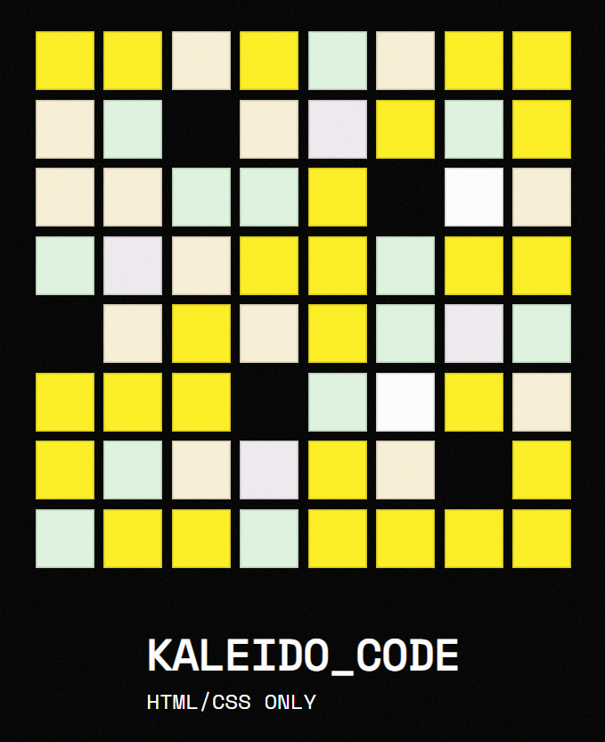

# CSS to the Rescue
Mijn repo voor het vak CSS to the Rescue

## Mijn leerdoelen
- Ik wil leren hoe ik creatieve en speelse interacties kan bouwen met HTML, CSS en JavaScript in plaats van “alleen functionele” interfaces.
- Ik wil beter worden in experimenteren, niet terughoudend zijn met dingen uitproberen.
- Ik wil beter worden in het maken en vastleggen van verschillende iteraties en hoe feedback hierin terugkomt.

## Mijn voortgang

### Woensdag 18/02
**Wat heb ik vandaag gedaan?**  
  Kick-off van CSS gehad. Toen de hele dag gewerkt aan scroll state queries en hier een Codepen mee gemaakt.    
**Hoeveel tijd heeft me dat gekost?**  
  Tot half 4 ben ik hiermee bezig geweest, met +/- anderhalf uur pauze tussendoor.    
**Wat heb ik geleerd?** 
  Scroll state queries zorgen ervoor dat je styles kan toepassen gebaseerd op de richting waarin de gebruiker scrollt. Je past het toe door container-type: scroll-state; op de parent element te zetten. Daarna kan je scroll-state() gebruiken als een container query: bijv scroll-state(scrolled: bottom).    
**Wat ga ik morgen doen?** 
  Presenteren en beginnen aan de eindopdracht.    

### Donderdag 19/02
**Wat heb ik vandaag gedaan?**  
  Werk van gisteren gepresenteerd. Toen om 1u de kick-off van de eindopdracht gehad en hieraan gewerkt tot half 4. Ik heb inspiratie opgedaan voor de eindopdracht. Toen de check-out gedaan en daarna ben ik naar de Weekly Nerd sessie gegaan.    
**Hoeveel tijd heeft me dat gekost?**  
  De presentaties waren van 10-12. Daarna een uurtje pauze en toen heb ik van 13-15:30 gewerkt.    
**Wat heb ik geleerd?** 
  Heel veel nieuwe dingen bij de presentaties. Vooral anchors en :has vond ik heel cool.    
**Wat ga ik morgen doen?** 
  Feedbackgesprekken en ik ga verder werken.    

---

### Voortgang 1
  Ik ga de opdracht CMD Artifaction doen. Ik wil hiervoor sowieso CSS nesting en @layer gebruiken.
  Inspiratie tot nu toe:    
  
    
Meeting notes:    
- svgomg  
- svg { { path fill: ...; }  }  
- border: solid currentColor;  
- preserveAspectRatio = "none" svg stretch  
- url encoder for svg  
- ana tudor  
- je kan keyframes in url() zetten  

---

### Woensdag 04/03
**Wat heb ik vandaag gedaan?**  
  Geluisterd naar de Weekly Nerd talk, toen 3 workshops gedaan en daarna heb ik mijn mappenstructuur gemaakt. Ben begonnen met html en css. Ik had wat coole ideeën gevonden, waardoor ik geïnspireerd werd, in combinatie met de workshops. Ik wil elementen 3d animeren om een soort sterrenstelsel effect te krijgen, en hier randomness op toepassen.    
**Hoeveel tijd heeft me dat gekost?**  
  Om 13:00 begon ik met de mappen enz, tot die tijd de talk en workshops. Een half uurtje gedaan over readme updaten.    
**Wat heb ik geleerd?**  
  Vrijwel alles wat aan bod kwam bij de workshops. Ik vond steps() heel interessant en Nils liet zien hoe je een color randomizer maakt, dat vond ik ook heel vet. Dit was ook nieuw voor mij: animation-delay: calc(-2s / sibling-count() * sibling-index() );.    
**Wat ga ik morgen doen?**  
  Verder aan de code en in de middag het voortgangsgesprek doen.    

---
### Donderdag 05/03
**Wat heb ik vandaag gedaan?**  
  Ik heb de workshop over animeren gevolgd. Daarna ben ik gaan werken aan css, fonts in gitignore en toen de check-out.
**Hoeveel tijd heeft me dat gekost?**  
  Workshop duurde een uur. Ik heb tot kwart voor 3 gewerkt aan mijn code en daarna heb ik het voortgangsgesprek gedaan. Daarna heb ik mijn readme geüpdated. 
**Wat heb ik geleerd?**  
  Introductie van keyframe animaties en pixel art animation maken met steps(2, jump-none).
**Wat ga ik morgen doen?**  
  Voortgangsgesprek voor BT en aan mijn blog werken.

---

### Voortgang 2
  Ik ga een zonnestelsel geïnspireerd iets maken wat op (seemingly) random manieren beweegt. Voor de planeten wil ik de CMD iconen gebruiken en deze zo aanpassen dat ze op planeten lijken. Het lijkt me ook leuk als je met een knop/refresh de iconen kan randomizen.    
  Inspiratie: https://nl.pinterest.com/pin/624311567142357621/    

  Meeting notes:    
  - sibling index for random movement of the planets
  - randomness on media query width
  - add a line in the middle that you can't see from the front but is visible from the side
  - pill shape: border-radius: 100vw;
  - animato to/from: sometimes it is helpful to leave out from, if elements have different starting points and travel to the same point

  - Show your progress (text, code and pictures):
  - What went smoothly, and what was challenging?
  - What experiments did you conduct that 'failed'?
  - Do you have new insights into how to leverage the power of CSS (or not)?
  - Incorporate changes to your initial plan:
  - The challenges for next week:

---

### Voortgang 3
gebruik deze website voor css patronen: https://css-pattern.com/
codepen voor randomness inspiratie: https://codepen.io/enbee81/pen/ZYpJyre?editors=1100
probeer meer randomness toe te passen in de code, bijv op de shapes, border, box shadow, outline en positionering van de elementen op de grid, ect. goed dat je de cmd kleuren hebt gebruikt. hij was benieuwd wat ik zou gaan maken. 

---

### Herkansing
Ik heb geëxperimenteerd met sterren animaties (zie mapje oude_tests), maar ik was daar niet tevreden mee want ik wist niet zo goed hoe ik dat echt random ging maken. Vervolgens kwam inspiratie tegen van een kaleidoscoop en het leek me leuk om daar inspiratie uit te halen voor dit project. 
Ik heb nog eens gekeken naar de artifaction.io website en heb ervoor gekozen om toch meer deze kant op te gaan en om een kaleidoscoop effect er in te verwerken d.m.v. regenboogkleuren en vervormingen. 
eerst heb ik een grid gemaakt met de cmd kleuren

vervolgens heb ik patronen die nils had gelinkt er in verwerkt

toen had ik een glitch effect gemaakt voor de h1 een header en footer toegevoegd

toen heb ik een rgb modus toegevoegd waarmee het grid door een cyclus van verschillende kleuren gaat

tot slot heb ik de cmd iconen toegevoegd

op het einde zag ik dat de fonts ook binnen de cmd huisstijl moeten passen, dus heb ik ze veranderd naar open sans.

---

### Hoe ik randomness heb gemaakt zonder javascript

Ik wilde dat het grid er random en generatief uit zou zien, maar natuurlijk zonder javascript. Dit is hoe ik dat heb gedaan:

1. **Cicada principle**
   De animatie-duraties zijn allemaal priemgetallen (bijv `7.3s`, `5.3s`, `11.7s`). Doordat priemgetallen bijna nooit tegelijk uitkomen, duurt het super lang voordat de animaties zich herhalen. Daardoor lijkt het alsof het random is, maar het is gewoon wiskunde. Elke cel heeft 3 animaties tegelijk: spin, pulse en glitch. Er zijn 4 glitch-varianten (a/b/c/d) die via nth-child verdeeld worden.

2. **Inline css variabele `--i`**
   Elke div in het grid heeft een eigen `--i` waarde (1 t/m 64). Die gebruik ik in `calc(var(--i) * -0.75s)` als negatieve animation-delay voor de glitch-cyclus. Zo zit elke cel op een ander punt in de 48s cyclus. 64 cellen × 0.75s = 48s, dus ze zijn precies gelijkmatig verdeeld. De glitch wisselt de `order` property, waardoor cellen van plek wisselen in het grid.

3. **nth-child met priemgetallen**
   met `nth-child(2n)`, `nth-child(3n)`, `nth-child(5n)` enz. verdeel ik kleuren, cmd iconen en css-patronen over het grid. doordat ik priemgetallen gebruik overlappen ze bijna nooit op dezelfde manier, dus het ziet er steeds anders uit zonder dat ik elke cel apart hoef te stylen. de css-patronen op `7n` en `11n` overschrijven de iconen door source order.

---

### Gebruikte moderne CSS-technieken

1. **CSS nesting**
   Selectors zijn genest met `&`, bijv `&:hover`, `&::before`. Scheelt een hoop herhaling van parent selectors.
2. **@layer**
   De css is verdeeld in 7 lagen: `basis`, `layout`, `cellen`, `patronen`, `animaties`, `typografie`, `interactie`. De volgorde bepaalt welke laag wint bij conflicten, ongeacht specificiteit. Zo wint hover (interactie) altijd van animaties.
3. **:has()**
   De rgb mode toggle werkt met `main:has(input:checked)`. Als de checkbox gecheckt is, krijgt het hele grid een `hue-rotate` animatie. Geen javascript nodig.
4. **Custom properties (css variabelen)**
   kleuren, fonts en celgrootte staan allemaal in `:root` als variabelen. De `--cell-color` variabele wordt per cel gezet via nth-child en doorgegeven aan `::before`.
5. **@font-face**
   open sans wordt lokaal geladen uit de `fonts/` map in plaats van via google fonts.

---

### Bronnen
- inline --i: https://css-tricks.com/3d-layered-text-the-basics/
- css patterns: https://css-pattern.com/
  - curved lines pattern: https://css-pattern.com/curved-lines/
  - overlapping circles pattern: https://css-pattern.com/overlapping-circles/
  - geometric flowers pattern: https://css-pattern.com/geometric-flowers/
- content: attr(data-text): https://developer.mozilla.org/en-US/docs/Web/CSS/Reference/Values/attr
- @layer: https://developer.mozilla.org/en-US/docs/Web/CSS/@layer
- :has(): https://developer.mozilla.org/en-US/docs/Web/CSS/:has
- cicada principe: https://www.sitepoint.com/the-cicada-principle-and-why-it-matters-to-web-designers/
- prompt voor css glitch: schrijf in css een 48s cyclus, 8 segmenten van elk 12.5%. elk segment: cel staat lang stil (~10%), dan een snelle reeks order-wissels (~2%) die eruit ziet als een glitch. de delay is calc(var(--i) * -0.75s), zo zijn alle 64 cellen gelijkmatig verdeeld over de cyclus: 64 × 0.75 = 48s.